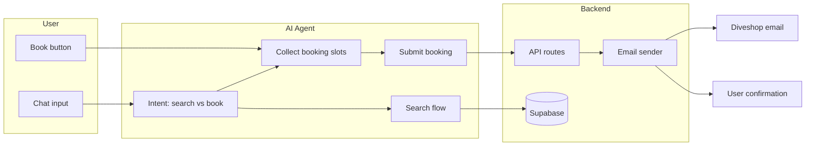
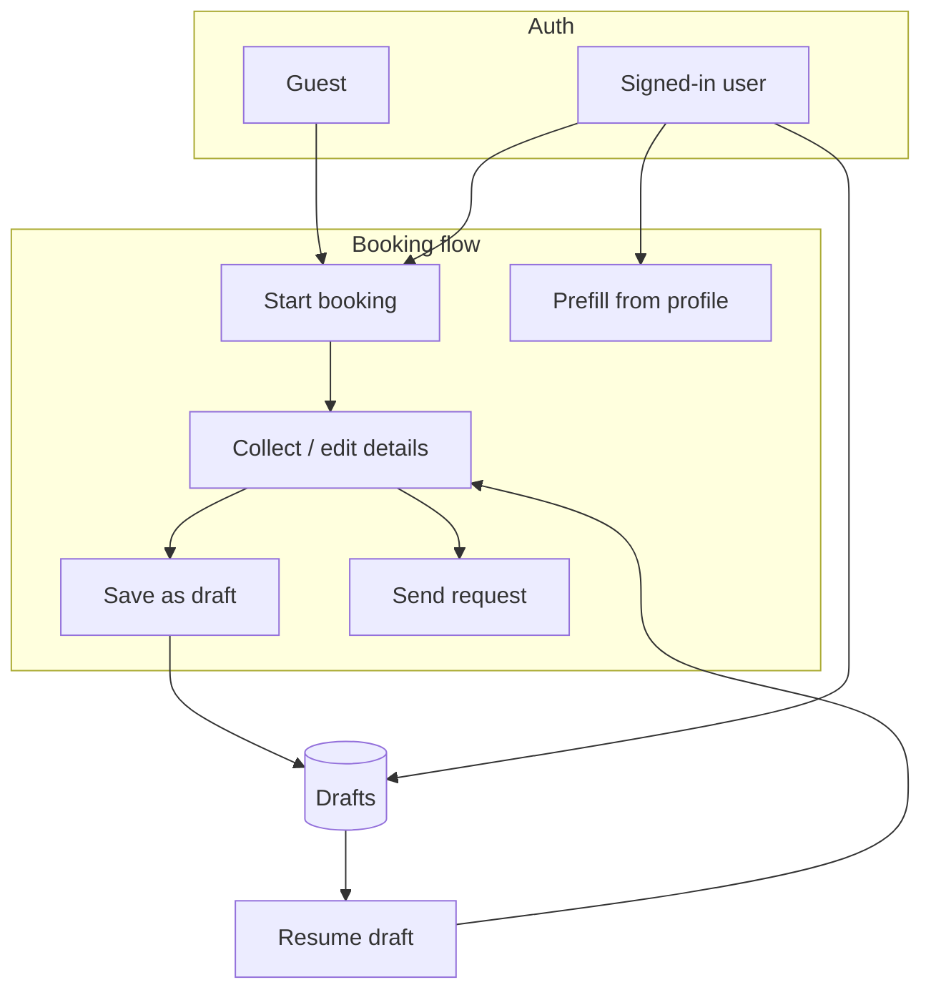

# AI Dive Trip Booking Agent — Plan 1 (Phase 1: Overall plan)

## TL;DR — For investors and non-tech founders

**What we’re building:** Users tell our AI what they want (e.g. “dive in Bali” or “book with that shop”); the AI finds options, collects trip details by chat, and sends the booking request to the dive shop by email. The user only answers questions—no long forms.

- **Plan 1 (this doc):** The overall product vision: one conversational flow for both finding shops and booking, emails to the shop and the customer, and (later) sign-in so users can save drafts and get prefilled on repeat trips.
- **Plan 2:** The AI learns to tell “I’m searching” vs “I’m booking,” asks for trip details in a friendly way, and offers tap-to-choose options (e.g. type of dive, region) so it feels like a travel agent, not a form.
- **Plan 3:** When the user is ready, we send their request by email to the dive shop and a confirmation to the customer; we use a reliable email provider so messages don’t get lost.
- **Plan 4:** The app shows a clear “Send my request to this shop?” step before sending, and the existing “Book” form can submit the same way so users can type everything manually if they prefer.
- **Plan 5 (optional):** A few days after a request, we email the customer to check if they and the shop have confirmed—reduces no-shows and keeps the trip top of mind.
- **Plan 6:** Users can sign in (Google, email, or magic link), save half-finished bookings as drafts, and next time get their details prefilled so repeat bookings are faster.

---

## Current state

- **AI agent**: [server/api/ai-search.post.ts](server/api/ai-search.post.ts) — search-only. Extracts filters (country, locale, region, minRating, languages), queries [buildDiveShopQuery](server/utils/buildDiveShopQuery.ts), returns shops; no booking intent.
- **Booking form**: [app/components/BookingForm.vue](app/components/BookingForm.vue) — full UI (name, email, dates, desired dive sites, number of divers, per-diver details + gear). Opened from [DiveShopDetail](app/components/DiveShopDetail.vue) via "Book" → drawer. Submit is `console.log` + close; no API or email.
- **Shop data**: [DiveShopDetail](app/components/DiveShopDetail.vue) fetches shop via Supabase `diveshops` + `country`/`region` only. No `diveshop_dive_sites` or `rental_equipment` in app yet.
- **Email**: None. Only `mailto:` links in the app.

---

## User engagement patterns (how users start)

| Entry point          | Example                                                                         | Agent behavior                                                                                                 |
| -------------------- | ------------------------------------------------------------------------------- | -------------------------------------------------------------------------------------------------------------- |
| **By location**      | "I want to dive in Bali"                                                        | Search → show shops → user picks one → then "I'd like to book with the first one" or user clicks Book on card. |
| **By type of dive**  | "Wreck diving in the Caribbean"                                                 | Search (extend filters for dive type / site type if desired) → show shops → pick → book.                       |
| **By specific shop** | "Book with [Shop Name]" or user already has a shop open and says "Book my trip" | Resolve shop (from context or name), then run booking flow.                                                    |
| **Direct book**      | User clicked a shop and clicks "Book" in UI                                     | Current drawer path; can stay as “manual form” or become “AI will ask you a few questions” and then send.      |

All paths converge to: **one selected shop** + **conversational collection of booking data** → **agent sends request (email)**. User only answers questions; no manual form filling required for the primary flow.

---

## Architecture (high level)

- **Search flow**: unchanged in spirit; optional enhancement for “type of dive” (dive_site_types / courses) later.
- **Booking flow**: intent = “book” → agent has or resolves `shopId` → asks for name, email, dates, # divers, then per-diver (name, cert#, dives, height, weight, gear), then desired dive sites (from that shop). When complete → call booking API with payload → API sends email to shop + confirmation to user.

---

## Conversational style and chat UX

**Target: travel-agent-like, not a cold form.** The chat should feel like talking to a helpful dive travel agent: friendly, asking natural follow-up questions (e.g. "Are you looking to take a course or mostly fun dives?" "What kind of diving are you most excited about — wrecks, reefs, big animals?"), and only then narrowing to location, dates, etc. It should not feel like a rigid form where the agent fires one question after another with no personality. System prompts and response style should enforce this tone.

**Selectable options in chat.** When the agent asks about type of dive, goals, or courses, the options should be **selectable in the UI** (e.g. chips, quick-reply buttons, or clickable suggestions) so the user can tap "Wreck diving," "Open Water course," "Reef / wildlife," etc., instead of only typing. Those options should be driven by real data where possible (e.g. `dive_site_types`, `courses` in Supabase) so we show "these are the dive types we can filter by" rather than free text only. Implementation: agent returns structured suggestions (or we derive them from context); frontend renders them as selectable options that send the corresponding message or filter.

**Abstraction / broadening (narrow → wider).** The codebase already has logic for when there are few results: the agent suggests broadening (e.g. "I found only 2 shops in Bali. Want me to search all of Indonesia?"). We should **keep and reinforce** this: let the user progressively widen (e.g. Bali → Indonesia → Southeast Asia) to get more options. The agent should offer these as clear, selectable suggestions (e.g. "Search Indonesia instead" / "Search Southeast Asia") so it feels conversational rather than a dead end. Document this as part of the search flow so it's not lost when we add booking intent.

---

## User accounts, drafts, and recurring bookings

**User accounts** (Supabase Auth) support two behaviors:

1. **Recurring bookings** — Signed-in users can have a saved **profile** (name, email, default diver details). When starting a new booking (chat or form), prefill from profile so returning users don’t re-enter everything.
2. **Draft bookings** — Users who are not finished can **save as draft**. Drafts are stored per user and can be resumed later (same shop + partial payload). Anonymous users can be prompted to sign in or create an account to save a draft.

**Design choices:**

- **Auth**: Supabase Auth with sign-up via **Google**, **email/password**, or **magic link** (decided). App currently has no auth UI; add login/signup (e.g. on Profile or modal) and pass JWT to API where needed.
- **Profile**: One row per user (e.g. `profiles` or `user_profiles` keyed by `auth.uid()`): display name, email, optional default diver (name, cert number, height/weight units). Updated when user completes a booking or edits profile. Agent and form prefill from profile when `user` is present.
- **Drafts**: Table `booking_drafts` (or `bookings` with `status = 'draft'`): `user_id`, `shop_id`, `payload` (JSONB), `updated_at`. List drafts on Profile or a “My drafts” area; “Resume” loads shop + payload into the form or chat context so user can continue. Only authenticated users can save/list drafts; guest flow stays “one shot” or “sign in to save”.
- **Recurring bookings**: No separate concept—each booking is a new request. “Recurring” = same user books again and gets prefilled from profile + optional “copy from previous booking” (last sent booking) for diver list/dates.

---

## Phase 1 — Overall plan (what we build)

1. **Unified agent (search + book)**
  - Single entry: extend existing `ai-search` with **intent detection** (`search` vs `book`).  
  - **Booking state**: frontend holds and sends the accumulated payload each turn (see Open decisions); backend stays stateless.  
  - For **book** intent: either shop from context (e.g. “book with the first one” after search) or from explicit name (“book with XYZ Dive Center”). Resolve shop via Supabase (by name / id).  
  - Agent asks **one question at a time** and fills a structured booking payload; when all required slots are filled, return a **BOOKING_READY** (or similar) response with payload so the frontend can call the booking API (or the same API sends email and returns success).
2. **Booking API and email**
  - **POST /api/booking** (or similar): body = booking payload (shopId, name, email, startDate, endDate, desiredDiveSites[], divers[]).  
  - Validate payload; load shop (email, business_name) from Supabase.  
  - **Email to diveshop**: “Booking request from Glaucus” + structured summary (dates, divers, desired sites, contact).  
  - **Email to user**: “We’ve sent your request to [Shop]. They’ll contact you at [email].”  
  - Use a transactional provider (e.g. Resend, SendGrid); config (API key) in env.
3. **Optional: follow-up email**
  - “Have you and [Shop] confirmed your booking?” e.g. 2–3 days later. Implement via cron/scheduled job or a simple “reminder” endpoint called by an external scheduler; store minimal state (e.g. booking id + user email + shop name) if needed.
4. **Form and data**
  - **BookingForm**: Keep as optional “manual” path or **confirmation view**: show payload the agent collected and “Send request” so user can edit and send. Primary flow = agent sends without user touching form.  
  - **Dive sites per shop**: API or composable to fetch `diveshop_dive_sites` + `dive_sites(name)` for a `shopId` so the agent (or form) can list site options.  
  - **Rental gear**: Optionally load from `rental_equipment` (or keep current static list in form) for consistency with DB.
5. **Frontend**
  - **Chat**: When agent returns BOOKING_READY, show “Send booking request to [Shop]?” and a confirm button; on confirm call POST /api/booking and show “Request sent. Check your email.”  
  - **Alternative**: Agent response includes “I’ve sent your request” and the server sends email in the same turn (agent calls booking API internally). Prefer **explicit user confirm** before sending.  
  - **Shop context**: Keep passing `selectedShopId` (and last search results) so “book with the first one” can resolve to that shop.
6. **User accounts (optional but recommended)**
  - **Auth**: Supabase Auth for sign-in/sign-up so users can have a persistent identity.
  - **Profile**: Store default name, email, and optional default diver details; prefill booking (chat + form) for signed-in users to support **recurring bookings**.
  - **Drafts**: Store incomplete bookings as drafts (per user); “Save draft” and “Resume” from Profile or in-flow. Guests can be prompted to sign in to save a draft.

---

## Implementation plans (Phase 2–6)

Each phase is a **separate plan** for implementation. Use Plan 1 (this document) for context and scope; use the plan below for the phase you're building.

| Plan       | Phase        | Description                                                                                                                             | File                                                                                                                     |
| ---------- | ------------ | --------------------------------------------------------------------------------------------------------------------------------------- | ------------------------------------------------------------------------------------------------------------------------ |
| **Plan 2** | Micro plan 1 | Agent intent and booking flow — extend ai-search with search vs book intent, collect booking payload, BOOKING_READY, selectable options | [ai_dive_booking_plan_2_agent_intent.plan.md](.cursor/plans/ai_dive_booking_plan_2_agent_intent.plan.md)                 |
| **Plan 3** | Micro plan 2 | Booking API and email — POST /api/booking, send to diveshop + user, Resend/SendGrid                                                     | [ai_dive_booking_plan_3_booking_api_email.plan.md](.cursor/plans/ai_dive_booking_plan_3_booking_api_email.plan.md)       |
| **Plan 4** | Micro plan 3 | Frontend wiring — BOOKING_READY + confirm button, form submit → API, selectedShopId, dive sites in form                                 | [ai_dive_booking_plan_4_frontend_wiring.plan.md](.cursor/plans/ai_dive_booking_plan_4_frontend_wiring.plan.md)           |
| **Plan 5** | Micro plan 4 | Follow-up email (optional) — reminder 2–3 days after booking sent; cron + bookings table                                                | [ai_dive_booking_plan_5_followup_email.plan.md](.cursor/plans/ai_dive_booking_plan_5_followup_email.plan.md)             |
| **Plan 6** | Micro plan 5 | User accounts, profiles, and drafts — Supabase Auth (Google + email + magic link), profiles, booking_drafts, prefill, Save/Resume draft | [ai_dive_booking_plan_6_user_accounts_drafts.plan.md](.cursor/plans/ai_dive_booking_plan_6_user_accounts_drafts.plan.md) |

**Suggested implementation order:** Plan 3 → Plan 2 → Plan 4 → (Plan 5 if desired) → Plan 6 (can run in parallel with 2–4 for guest-only booking first).

## Data and schema notes

- **Dive sites for a shop**: Query `diveshop_dive_sites` where `diveshop_id = ?` join `dive_sites(id, name)`. Expose via server API (e.g. `GET /api/shops/[id]/dive-sites`) or in the agent by loading in the booking flow.  
- **Rental equipment**: `rental_equipment` table exists; form currently uses a static list. Can later restrict gear options per shop via `diveshop_rental_equipment` for the confirmation form.  
- **diveshops.email**: Required for sending to the shop; handle missing email in API and UI (e.g. “This shop can’t receive requests by email; here’s their phone/website.”).  
- **Test dive shops**: The team will create test dive shops (with valid emails) for testing the booking/email flow. No need to build test-shop creation into this plan; implementation can assume shops exist in the DB for email testing.  
- **profiles**: `id` = auth.users.id, display_name, email, default_diver (jsonb). RLS: own row only.  
- **booking_drafts**: id, user_id, shop_id, payload (jsonb), created_at, updated_at. RLS: own rows only.  
- **bookings** (sent): id, user_id (nullable), shop_id, user_email, payload snapshot, status (`sent`), created_at; optional for follow-up and “past bookings” list.

## Open decisions

### Booking state: where we keep the in-progress booking (decided)

When someone is halfway through a booking (we’ve already got their name and dates, say, but not yet diver details), that “in progress” information has to live somewhere. **We’re having the app hold it and send it with each message to the AI**, instead of the server remembering it in a separate session. For users, the experience is the same either way; for us it means less to build and no extra session storage to run. If the user refreshes the page before finishing, we lose the in-progress booking unless they’ve used “Save draft” (which we’ll support for signed-in users).

*(Technical: Frontend sends the accumulated booking payload with every chat request; the backend stays stateless. Pros: no session store or cleanup, simpler to scale, matches the existing ai-search pattern. Cons: each request is a bit larger; refresh loses state unless we add drafts/localStorage.)*

- **One agent (search = chat)**: AI search and AI chat are the same — one conversational endpoint (existing `ai-search`). Extend it with intent; no separate booking endpoint; the same conversation does search and booking.  
- **Follow-up email**: After we send a user’s booking request to a dive shop, we can optionally send them a second email 2–3 days later (e.g. “Have you and [Shop] confirmed your trip? If not, here’s their contact info.”). Decision: build this in the first release (v1) or defer until after core booking and email are solid. (See [Plan 5](.cursor/plans/ai_dive_booking_plan_5_followup_email.plan.md) for how it would work.)  
- **Dive-type search**: Dive types and courses should appear as **selectable options in the chat** when the agent asks (see Conversational style and chat UX). Backend filters for dive_site_types/courses can be added in this project or a later iteration; either way, the UI should offer tappable options, not just free text.  
- **Auth scope (decided)**: Sign-up with **Google** + **email/password** + **magic link**. All three options from day one.  
- **When to require auth**: Booking and search stay available to guests; only “Save draft” and “My drafts” / Profile require sign-in.  
- **Storing sent bookings**: If you store `bookings` for follow-up, you can also show “Past bookings” on Profile and optionally prefill “copy from last booking” for recurring users.

See the **Implementation plans (Phase 2–6)** table above for the five implementation plans and suggested order.