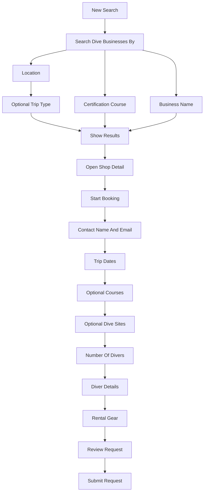

# Rails Search Plan

## Current Diagnosis

The screenshots show a deeper problem than a bad prompt: the app currently lets the LLM and two separate endpoint paths influence flow control. That makes repeated inputs unpredictable.

- `server/api/ai-search-stream.post.ts` and `server/api/ai-search.post.ts` do not share one route function. The same user phrase can take different paths depending on stream eligibility, NLU output, timing, and fallback behavior.
- `interpretUserTurn()` lets a model classify intent, destination, shop name, and activity. Even with JSON output, that is probabilistic enough to produce different route decisions.
- `server/utils/tripTypeSearchPipeline.ts` has a hard trip-type gate, but location fast paths can bypass it. That is why “I want to dive in Bali” can sometimes show chips and sometimes show results.
- Booking and search are interleaved in `server/api/ai-search.post.ts`, so a shop match can accidentally behave like booking progression.
- The UI currently encourages free text, then expects the backend to infer where the user wanted to go. That is the wrong tradeoff under time pressure.

## New Product Direction

Make the whole experience rails-first for now:

- The app, not the LLM, owns state and route decisions.
- Free text becomes secondary. Chips, result cards, forms, and controlled selectors become the main navigation.
- The LLM is removed from most situations. If kept, it only writes optional copy after deterministic state is known.
- Search and booking become two explicit flows with a clear handoff: search finds/selects a shop; booking collects details.
- Repeated inputs must produce repeated outputs.

## Proposed Super Flow

Primary chips:

- Search dive businesses by: `Location`, `Certification Course`, `Business Name`.
- Location: popular destinations plus controlled destination typeahead/search input.
- Certification course: `Discover Scuba`, `Open Water`, `Advanced Open Water`, `Rescue Diver`, `Divemaster`, `Nitrox`, `Specialty`.
- Business name: controlled shop-name search input, then exact/fuzzy DB matches.
- Trip type: `Dive Shop / Day Trip`, `Liveaboard`, `Resort`, `Any`.
- Result actions: `View details`, `Start booking`, `Show more`, `Change filters`.

Booking rails:

- Start booking: only from a known selected business (`shopId`) via `Start booking`.
- Contact: collect contact `name` and `email`.
- Trip dates: collect `startDate` and `endDate`; handle long-trip confirmation if needed.
- Courses: if the business lists certification courses, offer course chips plus `None / Skip` and `Done`; if no courses are listed, auto-skip with `desiredCourses: []`.
- Dive sites: if the business lists dive sites, offer dive-site chips plus `Any / Skip` and `Done`; if no sites are listed, auto-skip with `desiredDiveSites: []`.
- Diver count: collect `numberOfDivers`.
- Diver details: repeat for each diver in order: full name, certification number, number of dives, height, weight.
- Rental gear: ask gear needs per diver using the shop's rental gear chips; if no rental gear is listed, show the no-rental notice and continue.
- Review: show a pre-send summary and require explicit `Confirm send`; optional signup prompt follows the configured signup timing.
- Submit: send the booking request only after review confirmation.

## Implementation Plan

1. Define a deterministic flow contract:
   - Add a shared state shape such as `SearchFlowState` with `step`, `mode`, `destination`, `tripType`, `activity`, `selectedShopId`.
   - Define allowed steps and transitions in one utility, for example `shared/searchFlow.ts`.
   - Treat chips as commands, not natural-language suggestions.

2. Remove LLM routing from the hot path:
   - Stop using `interpretUserTurn()` for deciding search vs booking vs entity route.
   - Keep deterministic handlers for chip values, shop-name search, pagination, and booking continuation.
   - If an unsupported typed question arrives, return a controlled response with chips instead of asking the LLM to choose the flow.

3. Build chip-first search UI in `app/components/chat/ChatHome.vue`:
   - Show the next allowed choices from the flow state.
   - Start with “Search dive businesses by…” and the three branches: location, certification course, business name.
   - Prefer controlled typeahead/search inputs for location and business name rather than general chat input.
   - Keep the existing result cards and shop detail panel, but drive them from state transitions.

4. Split search from booking:
   - Search returns results, selected shops, and filter chips only.
   - Booking starts only from a `Start booking` chip/button or existing booking form CTA.
   - Booking receives a known `shopId` and proceeds through the explicit rails: contact, dates, courses, dive sites, diver count, diver details, gear, review, submit.

5. Temporarily reduce or disable streaming for guided flows:
   - Either make `/api/ai-search-stream` call the same deterministic flow engine, or route guided search through `/api/ai-search` only.
   - Avoid maintaining two independent implementations while the flow is being stabilized.

6. Keep a narrow typed fallback:
   - Recognize exact deterministic patterns like a shop name, country/city, or “show more”.
   - For open-ended education text like “how can I learn how to dive”, show a fixed beginner path: explanation card plus `Find beginner courses`, `Search destinations`, `Talk to a shop`.
   - Do not let the LLM decide where that user goes.

7. Verify with golden tests:
   - Same state + same command always returns same next state.
   - “I want to dive in Bali” always enters the same destination/trip-type/results path.
   - “Dive Porter” always performs shop-name search/open behavior.
   - “Start booking” is the only path from selected shop into booking.
   - Stream and JSON either share identical output or stream is bypassed for guided steps.

## Acceptance Criteria

- No LLM call is required to decide the user’s next step in search or booking.
- Chips/forms drive the main experience; free text is optional and constrained.
- The same input from the same state always produces the same response.
- Search never starts booking unless the user clicks/taps an explicit booking CTA.
- “I want to dive in Bali” follows one consistent guided flow.
- “Dive Porter” consistently searches/selects that shop from the DB.
- The implementation is small enough to ship under time pressure by stabilizing the existing UI instead of inventing a full new agent.