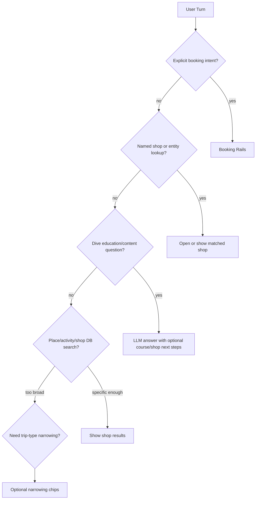

# Sandbox Search Plan

## Current Diagnosis

The search side is being forced through booking-style gates in three places:

- `server/api/ai-search-stream.post.ts` can return `tripTypeFirstQuestionResponse()` without running `probeReferentPhrase()` / `routeReferentFromProbe()`, so a search turn like “open Dive Porter” can stop at “What type of trip are you looking for?” instead of checking the DB.
- `server/api/ai-search.post.ts` treats a single matched shop as `resolvedByNamedShop`, then enters the booking branch even when the user did not ask to book. That is the core “search feels like booking rails” issue.
- `server/utils/tripTypeSearchPipeline.ts` makes trip type the first gate for broad searches. That can still be useful as a narrowing chip, but it should not block named-shop lookup or open-ended diving questions like “how can I learn how to dive?”

## Proposed Behavior

Search should route in this order:

## Implementation Plan

1. Add a search-first resolver in `server/utils/entityRouting.ts` or a small new utility like `server/utils/searchTurnRouting.ts`:
   - Resolve exact/fuzzy dive shop names before trip-type gating.
   - Return a search response for non-booking shop matches instead of `type: 'booking'`.
   - Preserve booking behavior only when `effectiveWantsToBook` is true.

2. Align `server/api/ai-search-stream.post.ts` with `server/api/ai-search.post.ts`:
   - If NLU produces `shop_name_hint` or regex produces a referent, run/fallback through the same entity resolver before `tripTypeFirstQuestionResponse()`.
   - Prefer JSON fallback for complex entity routes if duplicating logic would drift.

3. Add an “open matched shop” response contract:
   - Backend returns `intent: 'search'`, one matched shop in `shops`, and a field such as `openShopId` / `selectedShopId`.
   - `app/components/chat/ChatHome.vue` sets `selectedShopId` from that field even when `intent !== 'booking'`; on mobile, decide whether to also open `mobileDetailShopId` for explicit “open/show details” wording.

4. Loosen the trip-type gate in `server/utils/tripTypeSearchPipeline.ts`:
   - Do not ask trip type before named-shop, entity, location+activity, or education-answer routes.
   - Keep trip-type chips as optional narrowing for genuinely broad “find dive shops” searches, not as the default first response.

5. Add an open-ended dive content path:
   - Extend `interpretUserTurn` or add a lightweight classifier for education/help questions like “how can I learn how to dive”, “what certification do I need”, “what is nitrox”.
   - Return a concise LLM answer in the normal chat bubble, optionally with chips like “Find beginner courses near me” or “Search open water courses in [place]”.
   - Before changing model slugs, verify exact current OpenRouter IDs and use a current GPT-5.x mini/fast model within the project’s latest-model rule.

6. Verify with focused tests:
   - Unit tests for `shouldRunInterpretNlu()` / shop-name detection: “Dive Porter”, “open Dive Porter”, “search Dive Porter”.
   - Routing tests proving named-shop search does not enter booking unless the user says “book”.
   - Stream-path test proving it falls back/runs entity routing before trip-type chips.
   - Education query test for “how can I learn how to dive” returning an answer, not trip-type chips.

## Acceptance Criteria

- “Dive Porter”, “search Dive Porter”, and “open Dive Porter” find the DB shop and open/select it without starting booking.
- “Book Dive Porter” still starts the existing guided booking flow.
- “How can I learn how to dive?” gets an open-ended answer and helpful next steps, not “What type of trip are you looking for?”
- The trip-type chips still appear when they are actually useful for narrowing a broad shop search.
- Streaming and non-streaming search paths behave consistently.