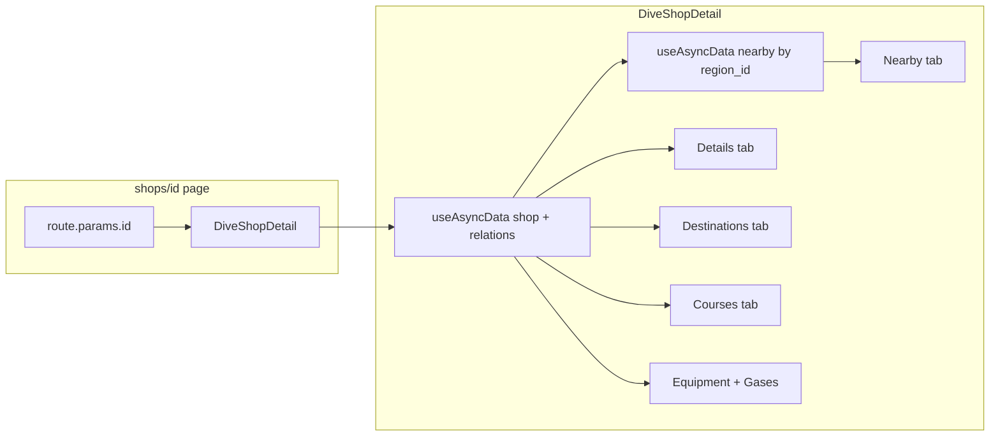

# Populate Shop Detail Pages with Real Supabase Data

## Current state

- [DiveShopDetail.vue](app/components/DiveShopDetail.vue) already fetches one shop from `diveshops` with `country` and `region` and uses it for: **header name**, **contact block** (address, phone, email, website), **Details tab** (hours, languages, description), and **Book Now** (shopId/shopName). Demo mode toggles hours/languages/description.
- **Dive Destinations**, **Courses**, **More Information** (equipment, gas, payment), **Reviews**, and **Nearby Dive Shops** are fully hardcoded.

## Schema summary

| UI datapoint | Source | Notes |
|--------------|--------|--------|
| Name, contact, hours, languages | `diveshops` | Already used. `operating_hours` JSONB, `languages` TEXT[] |
| Shop description | `diveshops.notes` | Component uses `description` which does not exist; DB has `notes` only |
| Dive destinations | `diveshop_dive_sites` → `dive_sites` (+ `dive_site_types`) | Group sites by type for cards |
| Courses | `diveshop_courses` → `courses` (+ `course_levels`, `agencies`) | certification_name, depth_limit, description |
| Equipment rental | `diveshop_rental_equipment` → `rental_equipment` | name only |
| Gas mixture | `diveshop_gases` → `gases` | name only (e.g. Nitrox; no "Air Fills" in ref data) |
| Payment methods | **No table** | **Comment out** section; add TODO for when schema exists |
| Reviews | **No table** | **Comment out** section; add TODO for when schema exists |
| Nearby shops | `diveshops` by same `region_id` (or `country_id`), exclude current | New query |

## Implementation plan

### 1. Fix description source and single fetch with relations

- **Description:** Use `notes` for the Details tab copy (component currently reads `shopData?.description`). In [DiveShopDetail.vue](app/components/DiveShopDetail.vue), change the `paragraphs` computed to use `shopData?.notes` (or add a `description` column in a migration if you want a separate long-form field).
- **Single enriched fetch:** Move the shop fetch into `DiveShopDetail.vue` only (remove duplicate from [app/pages/shops/[id].vue](app/pages/shops/[id].vue) and pass `shopId` only; page can use a shared key or the component's data for title). In the component, replace the current `diveshops` select with one that includes nested relations so one round-trip gives:
  - Shop + country + region (as now)
  - Courses: `diveshop_courses(course:courses(certification_name, depth_limit, description, course_level:course_levels(name), agency:agencies(name)))`
  - Rental equipment: `diveshop_rental_equipment(rental_equipment:rental_equipment(name))`
  - Gases: `diveshop_gases(gas:gases(name))`
  - Dive sites with type: `diveshop_dive_sites(dive_site:dive_sites(name, dive_site_type:dive_site_types(name)))`

Ensure Supabase relation names match your schema (e.g. `diveshop_courses` FK to `courses` may be selected as `courses(...)` — verify with actual table/column names).

### 2. Details tab

- Keep using `displayHours` and `displayLanguages` from existing computed (already from `shopData`).
- Wire description to `notes`: in the computed that drives the Details "Details" block, use `shopData?.notes` instead of `shopData?.description`, with the same "Read more" / paragraph splitting as now. If `notes` is null/empty, keep the current empty state copy.

### 3. Dive Destinations tab

- From the enriched fetch, take `diveshop_dive_sites` → `dive_site` with `dive_site_type.name`.
- In the component, group by `dive_site_type.name` (e.g. "Reef", "Wreck"), then for each type render a `CardInfo`: title = type name, items = list of `dive_site.name`, image = placeholder (e.g. `/images/fpo/destinations-beginner.png`) or a type-based image map if you add one later.
- If a shop has no dive sites, show an empty state (e.g. "No dive destinations listed") instead of the current hardcoded list.

### 4. Courses tab

- From the enriched fetch, take `diveshop_courses` → course with `certification_name`, `depth_limit`, `description`, and optionally `course_level.name` / `agency.name`.
- Map each course to a `CardInfo`: title = `certification_name`, items = array built from `depth_limit` and `description` (e.g. first line or a short snippet), and optional "Contact shop for dates" or level/agency. Use the same placeholder image as today unless you add course images later.
- If no courses, show an empty state.

### 5. More Information tab

- **Equipment rental:** From `diveshop_rental_equipment` → `rental_equipment.name`, render the first column list. Filter out "None listed" / "Yes (unspecified gear)" as in [getRentalEquipmentForShop.ts](server/utils/getRentalEquipmentForShop.ts). Empty state if none.
- **Gas mixture:** From `diveshop_gases` → `gases.name`, render the second column. DB has Nitrox, Trimix, etc.; no "Air Fills" in ref data — either add "Air" to `gases` and to shop links, or show only what's in DB.
- **Payment methods:** No table. **Comment out** the Payment Methods column (the entire third column block) in the template and add a brief HTML/JS comment: e.g. `<!-- TODO: wire when payment_methods + diveshop_payment_methods exist -->`. Do not show static placeholder list.

### 6. Reviews tab

- No `shop_reviews` (or similar) table. **Comment out** the Reviews tab content (the grid of `CardReview` components and any wrapper). In the tabs array, either remove "Reviews" or keep it but show an empty state with a message like "Reviews coming soon." Preferred: **comment out** the tab button and the tab panel so the tab does not appear until schema exists; add a short comment in code: `<!-- TODO: wire when shop_reviews table exists -->`.

### 7. Nearby Dive Shops tab

- Add a second query (e.g. `useAsyncData`) that runs once you have the current shop's `region_id` (and optionally `country_id`): select from `diveshops` where `region_id = :region_id` (and `id != :current_shop_id`), limit 6–8, with `country:countries(name)` if needed for display. If you have lat/long later, you could order by distance; for now ordering by name or `created_at` is fine.
- Pass the result into the component (or run this query inside DiveShopDetail after the main shop data is loaded, using `shopData.value?.region_id`).
- Render each as a card: shop name, optional locale/country, link to `/shops/{{ id }}`. Reuse `CardInfo` with title = business_name, items = [locale/country], and link wrapper; image = placeholder or shop image if you add it later. If there are no nearby shops, show an empty state.

### 8. Page and loading

- [app/pages/shops/[id].vue](app/pages/shops/[id].vue): Keep passing `shopId` and handling 404/loading at page level. Loading/error can still be driven by the same `useAsyncData` if the single source of truth for the main fetch is the page (then pass `shopData` as a prop) or by the component (then page uses a key like `diveshop-${shopId}` and component's pending/error, or refetch from component). Prefer one place for the main fetch (component) and page title from that data (e.g. via a shared key or by exposing shop name from component so the page can set `useHead`).

### 9. Edge cases and data quality

- **Aaron's Dive Shop ID:** Seed data uses `7f7ff68a-f63f-4306-bfc5-6a281932e3ac`; if the URL uses `4386` instead of `4306`, the page will 404. Align URL or seed so they match.
- **Empty states:** For each tab, if the corresponding Supabase list is empty, show a short message instead of an empty list or old placeholder content.
- **Demo mode:** Keep toggling only hours, languages, and description (notes); rest of the tabs always show live data from Supabase.

## Comment-out summary (add-later features)

- **Payment methods:** Comment out the third column (Payment Methods) in the More Information tab template; add `<!-- TODO: wire when payment_methods + diveshop_payment_methods exist -->`.
- **Reviews:** Comment out the Reviews tab button in the tabs array and the Reviews tab panel (the entire `v-if="activeTab === 'reviews'"` block); add `<!-- TODO: wire when shop_reviews table exists -->`. Optionally keep the tab id in the tabs array but hidden, or remove it so the tab list is Details, Dive Destinations, Courses, More Information, Nearby Dive Shops only.

## Suggested file changes

- [app/components/DiveShopDetail.vue](app/components/DiveShopDetail.vue): (1) Enriched `diveshops` select with nested relations; (2) use `notes` for description; (3) compute grouped destinations (by dive_site_type), courses list, equipment list, gases list from the payload; (4) replace hardcoded Destinations/Courses/Equipment/Gases with v-for over those computed arrays; (5) add `useAsyncData` for nearby shops (keyed by `shopId` and `region_id`); (6) replace hardcoded nearby cards with v-for over nearby result; (7) add empty states per tab; (8) **comment out** Payment Methods column and Reviews tab (see above).
- [app/pages/shops/[id].vue](app/pages/shops/[id].vue): Remove duplicate shop fetch; rely on component fetch for data and set page title from the same key. Keep loading/error handling.

## Optional schema (when enabling commented-out features)

- **Payment methods:** `payment_methods(id, name)`, `diveshop_payment_methods(diveshop_id, payment_method_id)`; then add to the enriched select and uncomment the third column in More Information.
- **Reviews:** e.g. `shop_reviews(id, diveshop_id, reviewer_name, reviewer_image_url, review_date, rating, source, review_text)`; then a separate fetch or nested select, map to `CardReview`, and uncomment the Reviews tab.
- **Description:** If `notes` is for internal use, add `description TEXT` to `diveshops` and migrate; then use `description` in the UI and keep `notes` for staff only.

## Data flow (high level)

---

Summary: One enriched Supabase query for shop + courses, equipment, gases, and dive sites (grouped by type); a second query for nearby shops by `region_id`; bind all tabs to that data with empty states; use `notes` for description; **comment out** Payment Methods column and Reviews tab with TODOs until schema exists.
