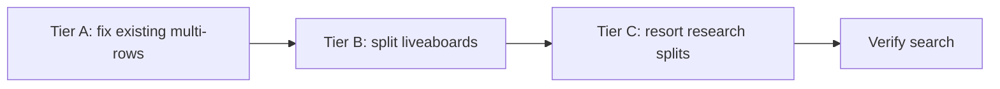

# Dive shop multi-location fix plan (Phase 2)

**Status:** Draft — execute only after reviewing [`diveshop-multi-location-audit.md`](diveshop-multi-location-audit.md)  
**Prerequisite:** Phase 1 audit approved  
**Scope:** Physical location rows only — no schema changes, **no dive-site junction cleanup**

---

## Goal

Each operating **location** gets its own `diveshops` row so users can search by city, state, country, and region. When splitting or cloning a row:

- **Change:** city, state, country_id, region_id (and address if location-specific)
- **Copy unchanged:** website, phone, email, type, courses, rental gear, gases, dive-site links, and all other fields

Dive sites linked across countries on a single row are **not** in scope for this work.

---

## Execution order



| Tier | Audit section | Risk | Est. new/changed rows |
|------|---------------|------|----------------------:|
| A | Section A | Low | ~0 new; 6 stubs fixed; 4 rows deduped |
| B | Section B | Medium | ~80–100 new rows |
| C | Section C | Medium | ~5–15 new rows (after research) |

---

## Tier A — Fix existing duplicate-name rows

Reference: audit Section A.

### A.1 Fix null city/state stubs (6 rows)

| Operator | Rows | Action |
|----------|------|--------|
| All Star Blackbeard's Cruises | 4 stubs (BVI, Cuba, Indonesia, Egypt) | Add embark city/state from allstarliveaboards.com per itinerary |
| Emperor Divers | 2 stubs (Indonesia, Solomon Islands) | Add embark port from emperordivers.com |
| Explorer Ventures | Saba row | Set `country_id` → Saba (or matching row in `countries` table) |
| Explorer Ventures | Silver Bank row | Set `country_id` → Dominican Republic |

### A.2 Deduplicate identical locations (4 rows → 2)

| Operator | Action |
|----------|--------|
| Blue Planet Divers | Merge into one Koh Lanta row; delete duplicate |
| Catalina Divers Supply | Merge into one Avalon row; delete duplicate |
| Force-E Scuba Centers | Keep one row each for Boca Raton and Pompano Beach; delete duplicate pairs |

### A.3 Minor cleanup

- Fix Force-E `Fort Laurderdale` → `Fort Lauderdale` typo

### Migration pattern (stubs + country fix)

```sql
UPDATE diveshops
SET city = :city, state = :state, country_id = :country_id, region_id = :region_id
WHERE id = :shop_id;
```

---

## Tier B — Split single-row operators into location rows

Reference: audit Section B. **Pilot:** Calico Jack Liveaboard.

### CSV convention (source of truth)

Update [`csvfiles/Scuba Master Database v.12 - DiveShops.csv`](../csvfiles/Scuba%20Master%20Database%20v.12%20-%20DiveShops.csv):

1. One row per physical embark / storefront location
2. Same `Dive Shop` name across rows
3. Change only: City, State, Country, Region, Address (optional)
4. Copy everything else from the template row (website, phone, email, courses, gear, gases, type, dive sites)

**Calico Jack example (4 rows):**

| Dive Shop | City | State | Country |
|-----------|------|-------|---------|
| Calico Jack Liveaboard | Labuan Bajo | East Nusa Tenggara | Indonesia |
| Calico Jack Liveaboard | Raja Ampat | West Papua | Indonesia |
| Calico Jack Liveaboard | *(TBD)* | North Maluku | Indonesia |
| Calico Jack Liveaboard | *(TBD)* | Maluku | Indonesia |

### SQL migration pattern (clone row)

```sql
-- 1) Insert new location row (location fields only differ)
INSERT INTO diveshops (
  business_name, street_address, website_url, city, state,
  phone, email, type, country_id, region_id
)
SELECT
  business_name, street_address, website_url,
  :new_city, :new_state,
  phone, email, type, :new_country_id, :new_region_id
FROM diveshops WHERE id = :template_id
RETURNING id;

-- slug set automatically by diveshops_set_slug_on_insert trigger

-- 2) Copy all junctions unchanged
INSERT INTO diveshop_courses (diveshop_id, course_id)
SELECT :new_id, course_id FROM diveshop_courses WHERE diveshop_id = :template_id;

INSERT INTO diveshop_rental_equipment (diveshop_id, rental_equipment_id)
SELECT :new_id, rental_equipment_id FROM diveshop_rental_equipment WHERE diveshop_id = :template_id;

INSERT INTO diveshop_gases (diveshop_id, gas_id)
SELECT :new_id, gas_id FROM diveshop_gases WHERE diveshop_id = :template_id;

INSERT INTO diveshop_dive_sites (diveshop_id, dive_site_id)
SELECT :new_id, dive_site_id FROM diveshop_dive_sites WHERE diveshop_id = :template_id;
```

### Batch order after Calico Jack pilot

1. Indonesia liveaboards (Sea Safari, Damai, Tiaré, Mermaid, Pindito, Seven Seas, White/Blue Manta, Dune Bali, Dive Concepts Penida)
2. Maldives fleet (White Pearl, Scubaspa, Maldives Master)
3. Mexico fleet (Nautilus, Fun Baja, Rocio del Mar, Dive Ninja)

Hand-write a focused data migration (`supabase migration new split_diveshop_locations`) — do not edit the historical 10k-line seed file.

---

## Tier C — Resort chains (manual research first)

Reference: audit Section C. **Do not split until physical bases are confirmed on operator websites.**

| Operator | Research source | Expected outcome |
|----------|-----------------|------------------|
| Dressel Divers | dresseldivers.com resort list | 4–8 location rows (Mexico, DR, Jamaica, …) |
| Pro Dive International | prodiveinternational.com | 2–4 Caribbean/Mexico location rows |
| Blue Ocean | blueocean-eg.com | 2–4 Red Sea resort location rows |
| Prodivers | — | Already one row per island; no change |
| Blue Marlin | — | Already two rows (Gili T + Komodo); optional brand rename only |

Document confirmed locations in migration SQL comments.

---

## Verification (post-migration)

### SQL checks

```sql
-- No remaining searchable stubs (exclude incomplete Okinawa imports)
SELECT business_name, c.name FROM diveshops d
LEFT JOIN countries c ON c.id = d.country_id
WHERE (city IS NULL OR trim(city) = '')
  AND (state IS NULL OR trim(state) = '')
  AND country_id IS NOT NULL;

-- Duplicate names at identical location
SELECT business_name, city, state, c.name, COUNT(*)
FROM diveshops d LEFT JOIN countries c ON c.id = d.country_id
GROUP BY 1,2,3,4 HAVING COUNT(*) > 1;
```

### Search smoke tests (chat / API)

| Query | Expected |
|-------|----------|
| "Komodo liveaboard" | Calico Jack, Damai, Sea Safari, … Komodo location rows |
| "Raja Ampat" | Split location rows for Indonesia operators |
| "Cozumel dive shop" | Dressel (after Tier C) or existing Cozumel rows |
| "Exuma liveaboard" | All Star Blackbeard's Bahamas row |
| "Malé liveaboard" | Emperor, Maldives Master, White Pearl rows |

---

## Blast radius

| Area | Severity | Notes |
|------|----------|-------|
| Chat / AI search | **High** | More rows match place filters; duplicate names need city/state disambiguation |
| Shop slugs / URLs | **Medium** | New rows get new slugs (`name-1`, `name-2`); existing URLs unchanged |
| Booking (`selectedShopId`) | **Medium** | In-progress bookings keep old id |
| Junction tables | **Medium** | Copy-on-split only; no bulk deletes |
| Admin shop list | **Low** | Already supports duplicate names |
| Nearby shops RPC | **Low** | Benefits from accurate geo rows |

---

## Files to touch (Phase 2)

| File | Change |
|------|--------|
| `csvfiles/Scuba Master Database v.12 - DiveShops.csv` | Row-per-location source data |
| `supabase/migrations/YYYYMMDD_split_diveshop_locations.sql` | New data migration |
| `docs/diveshop-multi-location-audit.md` | Update if counts change after fix |

**Do not modify:** `20250228000010_insert_diveshops_data.sql` (historical seed).

---

## Approval checklist

Before executing Phase 2:

- [ ] Section A stub cities and dedupe list reviewed
- [ ] Section B split list prioritized (Calico Jack pilot approved)
- [ ] Section C resort locations researched and confirmed
- [ ] Staging migration tested on Supabase branch
